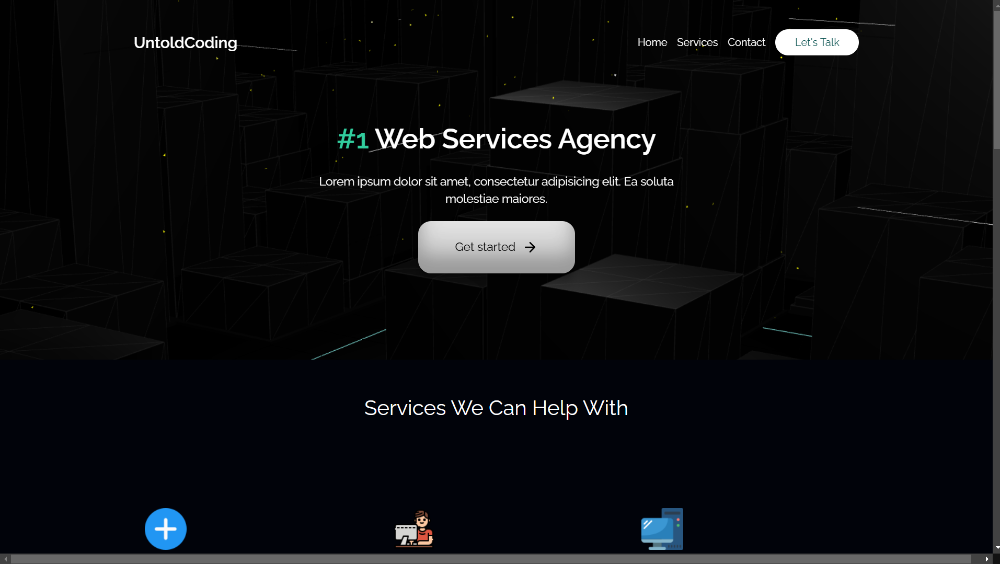

# 💻 Untol Coding Website


## 🚀 Introduction
The **Untol Coding Website** is a sample service-based website where users can explore various services, count their selections, and contact us for inquiries. The website features interactive elements and a visually appealing UI to enhance the user experience.

## 🌟 Features
- **Service Showcase** – Displays a variety of services offered.
- **Interactive UI** – Users can select services with dynamic interactions.
- **Contact Form** – Enables users to reach out with inquiries.
- **Smooth Animations** – Implemented using **GSAP** for enhanced visual appeal.
- **Responsive Design** – Adapts to different screen sizes.

## 🛠️ Technologies Used
- **HTML** – Structure of the web pages.
- **CSS** – Styling and layout.
- **JavaScript** – Interactive functionality.
- **Three.js** – For rendering 3D animations.
- **Bootstrap** – For a responsive and mobile-friendly design.
- **GSAP (GreenSock Animation Platform)** – For smooth animations and transitions.

## 📂 Installation & Usage
1. **Clone the repository:**
   ```bash
   git clone https://github.com/yashpatil-1/Untol-Coding-Website.git
   cd Untol-Coding-Website
   ```
2. **Open `index.html`** in your preferred browser.
3. Explore the services and contact us through the available options.

## 🎨 UI/UX Design
The website includes various interactive elements designed to create an engaging experience.

## 📸 Screenshots
*(Add relevant screenshots showcasing different sections of the website)*

## 🤝 Contributing
Feel free to fork this repository, improve the website, and submit pull requests.

## 📜 License
This project is licensed under the **MIT License**.

## 📞 Contact
For any questions or collaborations, reach out via **[workwithme.3215@gmail.com](mailto:workwithme.3215@gmail.com)** or visit my **[GitHub Profile](https://github.com/yashpatil-1)**.

---
Enjoy exploring and customizing **Untol Coding Website!** 🚀
